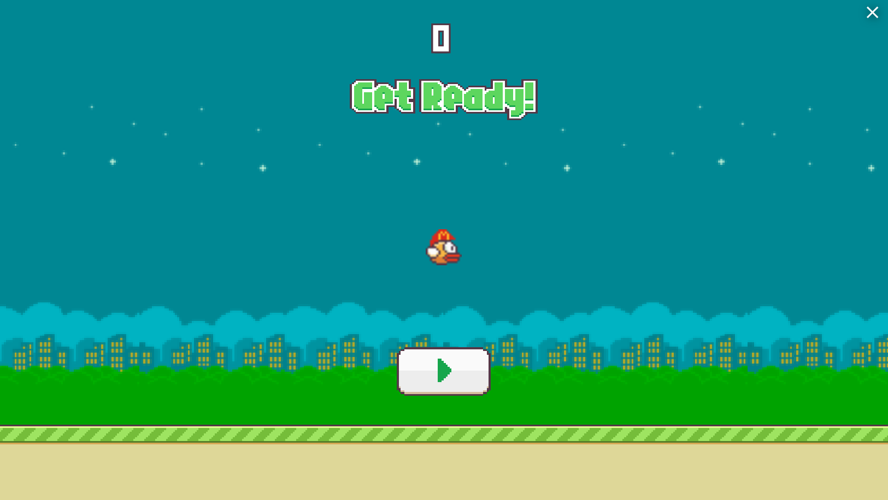

# Wassie Bird
A Flappy Bird clone with a crypto-themed twist! Take control of a [Wassie](https://www.urbandictionary.com/define.php?term=wassie) and soar between dreaded columns of fridges.

This is a arcade-style side-scroller built from scratch in Unity and exported to WebGL. Play [Here](https://play.unity.com/mg/other/wassie-bird).

*The code for the published version of the game been lost. This is an earlier version based on [unity-flappy-bird-tutorial](https://github.com/zigurous/unity-flappy-bird-tutorial/blob/main/Assets/Scripts/Pipes.cs)*
